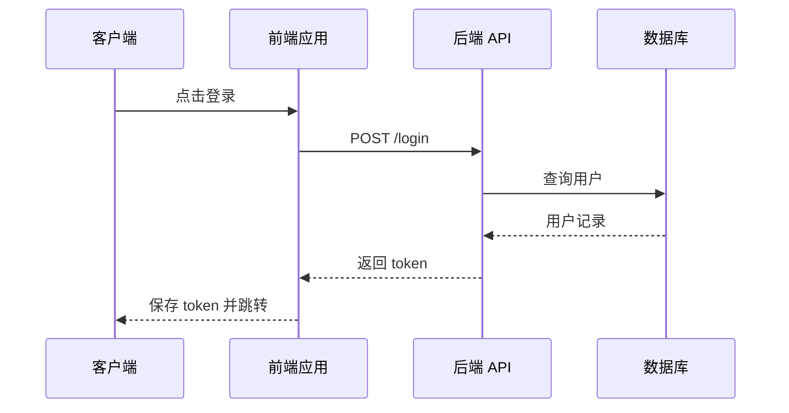
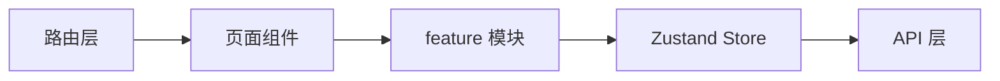
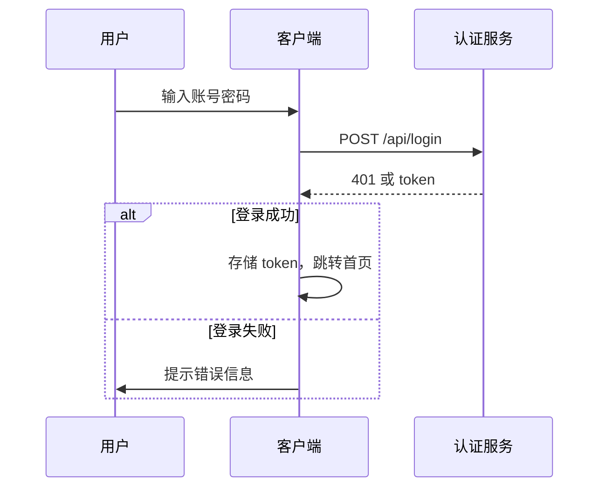

# 架构图

整理日期：2026-08-13

> 状态：已完成

## 目录

- [概述](#概述)
- [Context Diagram](#context-diagram)
- [Container Diagram](#container-diagram)
- [Component Diagram](#component-diagram)
- [Sequence Diagram](#sequence-diagram)
- [Deployment Diagram](#deployment-diagram)
- [应用场景实战](#应用场景实战)
- [最佳实践与踩坑记录](#最佳实践与踩坑记录)
- [相关文档](#相关文档)

## 概述

架构图把系统的结构和交互「画」出来，让复杂关系一目了然。C4 模型是画架构图的主流方法论，它把系统拆成 Context（上下文）、Container（容器）、Component（组件）、Code（代码）四层，每层面向不同受众、关注不同粒度。选择合适的图，比画得好看更重要。

```text
架构图的层次与受众：
1. Context Diagram —— 系统与外部世界的边界，面向所有人
2. Container Diagram —— 应用、数据库、服务等高层模块，面向技术管理
3. Component Diagram —— 容器内部的组件划分，面向开发者
4. Sequence Diagram —— 一次请求/交互的时序，面向开发者
5. Deployment Diagram —— 部署到哪些机器/环境，面向运维
```

## Context Diagram

Context Diagram（上下文图）是 C4 的第一层，画系统与外部用户、外部系统的关系。它只回答一个问题：我们做的系统处在什么位置、和谁打交道。

```text
┌──────────┐          ┌──────────────────┐          ┌──────────┐
│  用户    │──浏览──▶ │   电商 Web 应用   │──下单──▶ │  支付平台 │
└──────────┘          └──────────────────┘          └──────────┘
                              │
                              │ 查询
                              ▼
                      ┌──────────────┐
                      │  商品服务     │
                      └──────────────┘
```

```text
Context Diagram 的要点：
1. 只画系统边界 —— 内部细节一概不画
2. 明确参与者 —— 人（用户/管理员）和外部系统（支付/物流）
3. 标注关系 —— 箭头 + 动词说明交互意图
4. 受众最广 —— 给业务、管理层看也毫无压力
```

## Container Diagram

Container Diagram（容器图）是 C4 的第二层，把系统放大成若干个可独立部署的「容器」——Web 应用、移动 App、BFF、数据库等。它讲的是技术选型和职责边界。

```text
┌──────────────┐        ┌──────────────┐
│  浏览器 SPA   │──API──▶│     BFF      │
│  (React)     │        │  (Node.js)   │
└──────────────┘        └──────┬───────┘
                               │
                 ┌─────────────┼─────────────┐
                 ▼             ▼             ▼
          ┌──────────┐  ┌──────────┐  ┌──────────┐
          │ 用户服务  │  │ 商品服务  │  │ 订单服务  │
          └────┬─────┘  └────┬─────┘  └────┬─────┘
               └───────┬──────┘             │
                       ▼                    ▼
                ┌────────────┐        ┌────────────┐
                │  用户库 PG  │        │  订单库 PG  │
                └────────────┘        └────────────┘
```

```text
Container Diagram 的要点：
1. 容器 = 可独立部署单元 —— 应用、服务、数据库、消息队列
2. 标注技术栈 —— React / Node.js / PostgreSQL 等
3. 画出数据流 —— 谁调谁、数据往哪走
4. 面向技术管理 —— 展示总体技术架构和部署单元
```

## Component Diagram

Component Diagram（组件图）是 C4 的第三层，深入单个容器内部，画组件的划分和依赖关系。对前端而言，就是应用内部的模块、Store、路由、API 层等。

```text
┌─────────────────────── SPA 容器内部 ───────────────────────┐
│                                                           │
│  ┌──────────┐    ┌──────────┐    ┌──────────┐            │
│  │  路由层   │──▶│  页面组件 │──▶│  feature  │            │
│  └──────────┘    └──────────┘    │  modules  │            │
│                                  └────┬─────┘            │
│                                       │                  │
│                              ┌────────▼────────┐         │
│                              │   Zustand Store  │         │
│                              └────────┬────────┘         │
│                                       │                  │
│                              ┌────────▼────────┐         │
│                              │  API 层 (axios)  │         │
│                              └─────────────────┘         │
└───────────────────────────────────────────────────────────┘
```

```text
Component Diagram 的要点：
1. 面向开发者 —— 讲清容器内部如何组织
2. 标注职责 —— 每个组件/模块负责什么
3. 依赖方向 —— 体现分层和单向依赖
4. 与代码对应 —— 最好能和 src/ 目录对上
```

## Sequence Diagram

Sequence Diagram（时序图）描述一次交互中，各对象按时间顺序的消息传递。它是排查问题、设计复杂交互（如登录、下单）时最实用的图。

```text
客户端          前端应用          后端 API          数据库
  │  点击登录      │                 │               │
  │──────────────▶│                 │               │
  │               │  POST /login     │               │
  │               │────────────────▶│               │
  │               │                 │  查询用户      │
  │               │                 │──────────────▶│
  │               │                 │◀──────────────│
  │               │   返回 token     │               │
  │               │◀────────────────│               │
  │  保存 token    │                 │               │
  │◀──────────────│                 │               │
```



```text
Sequence Diagram 的要点：
1. 竖线 = 参与者，横箭头 = 消息
2. 实线箭头 = 同步调用，虚线 = 返回
3. 自顶向下 = 时间顺序
4. 适合画一次请求的完整链路
```

## Deployment Diagram

Deployment Diagram（部署图）描述系统运行在哪些节点上、各节点之间如何通信。它回答「这套系统部署在哪、有几台机器、网络怎么连」。

```text
┌────────────────────────── 用户侧 ──────────────────────────┐
│  浏览器 / 移动端                                            │
└──────────────────────────┬─────────────────────────────────┘
                           │ HTTPS
┌──────────────────────────▼─────────────────────────────────┐
│  CDN（静态资源）        Nginx 网关（入口 + 反向代理）         │
└──────────────────────────┬─────────────────────────────────┘
                           │
        ┌──────────────────┼──────────────────┐
        ▼                  ▼                  ▼
┌──────────────┐   ┌──────────────┐   ┌──────────────┐
│  Web 容器 x2  │   │  BFF 容器 x2  │   │  消息队列     │
│  (K8s Pod)   │   │  (K8s Pod)   │   │  (Kafka)     │
└──────────────┘   └──────────────┘   └──────────────┘
                                             │
                                    ┌────────▼────────┐
                                    │   数据库集群     │
                                    │  PostgreSQL x3  │
                                    └─────────────────┘
```

```text
Deployment Diagram 的要点：
1. 节点 = 物理/虚拟机器、容器、CDN 等
2. 标注数量 —— 几台实例、几副本，反映可用性
3. 标注协议 —— HTTPS、gRPC、消息等通信方式
4. 面向运维 —— 是容量规划和故障排查的依据
```

## 应用场景实战

### 场景一：用 Mermaid 在 Markdown 里画组件图

````markdown
# 组件图


````

### 场景二：用 Mermaid 画一次登录的时序图



## 最佳实践与踩坑记录

### 最佳实践

1. 用 C4 模型分层画图，先画 Context 再逐层深入，别一上来就画代码级细节
2. 图要标注受众和更新时间，避免「这是哪个版本的图」的困惑
3. 架构图用 Mermaid 等文本 DSL 维护，随代码进 Git、可 diff、可评审
4. 一张图只回答一个问题，塞太多信息的图没人看得懂
5. 图中的箭头要标动词（「下单」「查询」），而不是只画光秃秃的线

### 踩坑记录

```text
坑 1：一张图画所有层次
结论：图上塞满组件、数据库、网络，谁也看不懂，图形同虚设。
原因：想在一张图里表达所有信息，违反了「一图一问题」。
解法：按 C4 分层，每层一张图，从 Context 到 Component 逐步细化。

坑 2：架构图用绘图软件手工画
结论：改一点要重画整张图，图很快就过期没人维护。
原因：用 draw.io 等二进制工具，无法 diff、无法评审。
解法：改用 Mermaid / PlantUML 文本 DSL，图随代码进 Git。

坑 3：时序图漏画失败分支
结论：图上只有成功路径，异常处理在实现时被忽略。
原因：画图时只走了 happy path，没考虑超时、失败、重试。
解法：时序图用 alt/else 分支画出失败路径，倒逼设计补全异常。

坑 4：图不标注时间戳和作者
结论：拿着一张两年前的图做方案评审，结论全错。
原因：图没有版本和更新时间，无法判断是否仍有效。
解法：每张图标注生成日期和对应的代码版本，过期即标注「待更新」。

坑 5：部署图不标实例数量
结论：以为服务是单点，出了故障才发现没有冗余。
原因：部署图只画了逻辑节点，没画副本数和容灾。
解法：部署图标注实例数量、可用区、容灾策略，反映真实拓扑。
```

## 相关文档

- [[87.1-文档]] — 架构文档体系的文字部分
- [[87.3-文档工具]] — Mermaid 等绘图工具的语法与用法
- [[84-前端架构设计]] — 大型应用架构设计思路
- [[76-前端架构模式]] — 架构模式与图表达的对应关系
