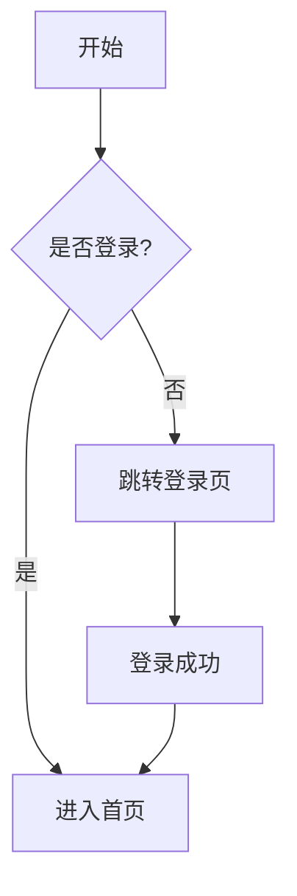
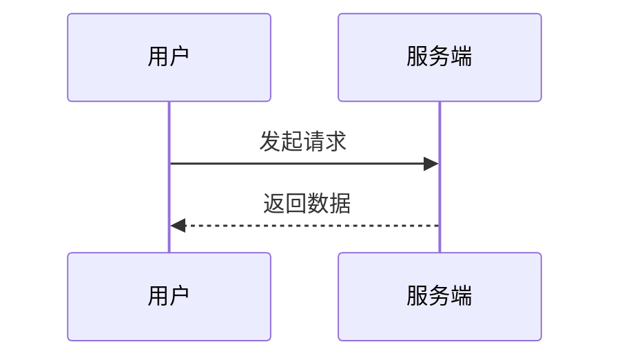

# 文档工具

整理日期：2026-08-13

> 状态：已完成

## 目录

- [概述](#概述)
- [Markdown](#markdown)
- [Mermaid](#mermaid)
- [Docusaurus](#docusaurus)
- [VitePress](#vitepress)
- [Storybook](#storybook)
- [应用场景实战](#应用场景实战)
- [最佳实践与踩坑记录](#最佳实践与踩坑记录)
- [相关文档](#相关文档)

## 概述

文档工具决定了「写文档」和「维护文档」的成本，也决定了文档能不能随代码一起演进。前端生态里，Markdown 是通用书写格式，Mermaid 负责把图画成文本，Docusaurus 和 VitePress 负责把 Markdown 变成可发布的站点，Storybook 则是组件库的专属文档工具。选对工具，文档才能长期活下去。

```text
文档工具的分工：
1. Markdown —— 书写格式，纯文本、可 diff、跨平台
2. Mermaid —— 文本画图，流程图/时序图/类图随 Markdown 走
3. Docusaurus —— React 技术栈的文档站，适合大型多项目站点
4. VitePress —— Vue 生态的文档站，轻快，适合中小型文档
5. Storybook —— 组件库的交互式文档，边看边玩组件
```

## Markdown

Markdown 是前端文档的事实标准：纯文本、语法简单、能被 Git 管理和 diff，几乎所有的文档站和仓库 README 都基于它。掌握标题、列表、代码块、表格、链接即可覆盖九成文档需求。

```markdown
# 一级标题

## 二级标题

- 无序列表项
1. 有序列表项

**加粗**、*斜体*、`行内代码`

```js
// 代码块，标注语言
const answer = 42;
```

| 列一 | 列二 |
| ---- | ---- |
| 值一 | 值二 |

[链接文字](https://example.com)
```

```text
Markdown 的常用扩展：
1. GFM —— GitHub Flavored Markdown，表格/任务列表/删除线
2. 代码块标注语言 —— 以 js 等语言标注开启语法高亮
3. 行内 HTML —— 复杂布局时可直接嵌入 HTML
4. Frontmatter —— 顶部 YAML 元信息，文档站用来生成目录和标签
```

## Mermaid

Mermaid 让「图」也变成文本，直接写在 Markdown 代码块里，随文档进 Git、可 diff、可版本管理。它支持流程图、时序图、类图、甘特图等，是前端写架构图、流程图的标配。





```text
Mermaid 的常用图类型：
1. graph —— 流程图（graph TD 自上而下 / LR 自左而右）
2. sequenceDiagram —— 时序图，描述交互顺序
3. classDiagram —— 类图，描述数据结构与关系
4. stateDiagram —— 状态图，描述状态机
5. gantt —— 甘特图，描述项目排期
```

## Docusaurus

Docusaurus 是 Meta 开源的 React 文档站框架，专为大型多版本文档设计。它支持版本化、国际化、博客、插件市场，适合需要长期维护的团队文档站。

```js
// docusaurus.config.js —— 站点配置核心
module.exports = {
  title: 'Shop Web 文档',
  tagline: '电商前端架构文档',
  url: 'https://docs.example.com',
  baseUrl: '/',
  i18n: {
    defaultLocale: 'zh-CN',
    locales: ['zh-CN', 'en'],
  },
  presets: [
    [
      '@docusaurus/preset-classic',
      {
        docs: {
          sidebarPath: require.resolve('./sidebars.js'),
        },
        blog: {
          showReadingTime: true,
        },
      },
    ],
  ],
};
```

```text
Docusaurus 的特点：
1. React 技术栈 —— 组件可用 JSX 扩展，团队熟悉
2. 版本化 —— 同一份文档可维护多个版本
3. 国际化 —— 内置 i18n，多语言站点开箱即用
4. MDX —— 文档里直接写 React 组件，适合交互式示例
5. 适合大型站点 —— 官方、插件多，但构建相对较重
```

## VitePress

VitePress 是 Vue 团队的文档站工具，基于 Vite 构建，启动和热更新极快。它语法简洁、体积轻，适合中小型文档和团队内部知识库。

```js
// .vitepress/config.js —— 配置侧边栏和导航
import { defineConfig } from 'vitepress'

export default defineConfig({
  title: 'Shop Web 文档',
  themeConfig: {
    nav: [
      { text: '指南', link: '/guide/' },
      { text: 'API', link: '/api/' },
    ],
    sidebar: {
      '/guide/': [
        { text: '快速开始', link: '/guide/getting-started' },
        { text: '架构', link: '/guide/architecture' },
      ],
    },
  },
})
```

```text
VitePress 的特点：
1. 极快 —— 基于 Vite，启动和热更新秒级
2. 零配置 —— 一个 config 文件即可开写 Markdown
3. Vue 生态 —— 主题和组件用 Vue 扩展
4. 适合轻量 —— 中小文档、内部知识库的首选
5. 构建产物小 —— 相对 Docusaurus 更轻
```

## Storybook

Storybook 是组件库的交互式文档工具，为每个组件生成独立的「故事」，可以在隔离环境里查看、调试、截图测试组件。它把「文档」和「可交互 demo」合二为一，是设计系统落地的核心工具。

```tsx
// Button.stories.tsx —— 一个组件的多个 story
import type { Meta, StoryObj } from '@storybook/react';
import { Button } from './Button';

const meta: Meta<typeof Button> = {
  title: 'Components/Button',
  component: Button,
  args: {
    children: '按钮',
  },
};
export default meta;

type Story = StoryObj<typeof Button>;

export const Primary: Story = {
  args: { variant: 'primary' },
};

export const Disabled: Story = {
  args: { variant: 'primary', disabled: true },
};

export const Loading: Story = {
  args: { variant: 'primary', loading: true },
};
```

```text
Storybook 的核心价值：
1. 隔离开发 —— 组件在独立环境渲染，不受业务干扰
2. 文档即 demo —— 每个 story 都是可交互示例
3. 视觉回归 —— 配合 Chromatic 做 UI 截图比对
4. 组件发现 —— 团队可在 Storybook 里浏览所有组件
5. 可测性 —— story 可直接被 Play 测试和单测复用
```

## 应用场景实战

### 场景一：用 VitePress 搭建团队知识库

```bash
# 初始化一个 VitePress 文档站
mkdir team-docs && cd team-docs
npm init -y
npm install -D vitepress
mkdir docs

# docs/index.md 写首页
echo '# 团队文档' > docs/index.md

# 启动开发服务器
npx vitepress dev docs
# 打开 http://localhost:5173，边写边看
```

### 场景二：用 Storybook 给组件库生成交互文档

```bash
# 在组件库里初始化 Storybook
npx storybook@latest init

# 写一个 Button 的 story 后启动
npm run storybook
# 浏览器打开 localhost:6006，即可浏览、调试、截图所有组件
```

## 最佳实践与踩坑记录

### 最佳实践

1. 文档统一用 Markdown + Mermaid，图和文字都进 Git，可 diff 可评审
2. 团队知识库优先选 VitePress，启动快、维护成本低
3. 组件库必须接 Storybook，让文档和可交互 demo 一体
4. 文档站的导航和侧边栏从目录结构约定生成，避免手写遗漏
5. Mermaid 图控制在 10 个节点内，太大就拆成多张
6. 文档站接入 CI，每次提交自动构建并部署，防止「本地能看线上没有」

### 踩坑记录

```text
坑 1：文档站不接 CI，手动发布
结论：文档改了但线上没更新，读者看到的还是旧内容。
原因：构建和部署靠人手动执行，常常忘记。
解法：文档站接 CI，push 到 main 自动 build + 部署。

坑 2：Mermaid 图越画越大
结论：一张流程图几十个节点，渲染出来根本看不清。
原因：图没有粒度控制，把所有分支都塞进一张图。
解法：单张图控制在 10 个节点内，复杂流程拆成多张图。

坑 3：Storybook 只有 demo 没有说明
结论：组件文档变成「一堆能点的按钮」，不知道 props 含义。
原因：story 只写了展示，没写注释和文档说明。
解法：用 docs 插件给每个 story 配说明，标注 props 的用途和边界。

坑 4：Docusaurus 和 VitePress 选型纠结
结论：团队在选型上反复讨论，文档站迟迟搭不起来。
原因：过度纠结工具差异，忽略了「先写起来」。
解法：中小文档直接用 VitePress，大型多版本用 Docusaurus，先跑起来再优化。

坑 5：Markdown 表格对齐靠空格手敲
结论：表格排版混乱，diff 时全是无意义的空格改动。
原因：手动用空格对齐表格列，改一个字全行重排。
解法：用编辑器插件自动格式化表格，diff 只显示真实内容变化。
```

## 相关文档

- [[87.1-文档]] — 架构文档体系里要写哪些文档
- [[87.2-架构图]] — 用 Mermaid 画 C4 架构图与时序图
- [[61.2-Storybook]] — 组件库工程的 Storybook 完整实践
- [[61-前端组件库工程]] — 组件库从开发到发布的整体流程
